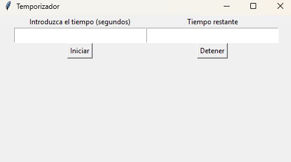

# Temporizador en Python

Este es un proyecto simple de un **temporizador** en **Python** utilizando la biblioteca **Tkinter**. El programa permite a los usuarios ingresar un tiempo en segundos y luego iniciar un temporizador que cuenta hacia atrás hasta llegar a cero. El temporizador se puede detener en cualquier momento.

<div align="center">
  
</div>

## Características

- Permite ingresar el tiempo en segundos.
- Inicia un temporizador que cuenta hacia atrás desde el tiempo ingresado.
- Muestra el tiempo restante en la interfaz.
- Opción para detener el temporizador antes de que llegue a cero.
- Interfaz gráfica simple creada con **Tkinter**.

## Requisitos

- Python 3.x
- Tkinter (generalmente viene preinstalado con Python)

## Instrucciones de Uso

1. **Instalación**: Asegúrate de tener **Python 3.x** instalado en tu sistema. Si no tienes Tkinter, puedes instalarlo usando el siguiente comando (si es necesario):

   ```bash
   pip install tk
